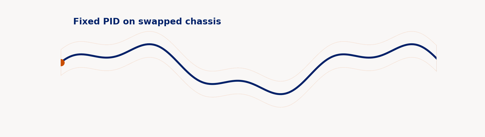
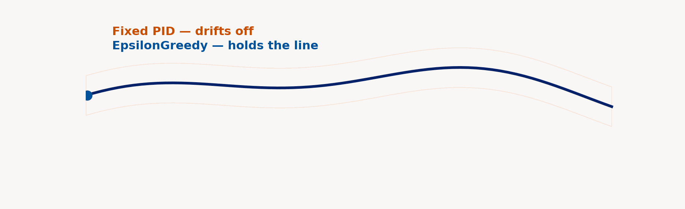

# AIPI 590 · Challenge 4: Line-Follow PID Tuner via Contextual Bandit

[](https://aipi590-ggn.github.io/aipi590-challenge-4/)
[](https://masters.pratt.duke.edu/)
[](https://www.python.org/)
[](https://rob.schapire.net/papers/www10.pdf)
[](LICENSE)

Adaptive PID gains for a line-following robot. When the chassis changes — a motor swap, different wheels, a payload — a contextual bandit picks new `kp, kd` from a short feature vector instead of making the student re-tune by hand.

---

## Interactive Dashboard

**[View Live Dashboard →](https://aipi590-ggn.github.io/aipi590-challenge-4/)**

Side-by-side policy comparison, chassis-swap mid-run, narrated story walkthrough, full experimental summary.

## What happens when the motor changes

<table>
  <tr>
    <td align="center" width="50%"><strong>Fixed PID on swapped chassis</strong></td>
    <td align="center" width="50%"><strong>Fixed vs bandit, same chassis</strong></td>
  </tr>
  <tr>
    <td></td>
    <td></td>
  </tr>
  <tr>
    <td align="center"><sub>Gains tuned for yesterday's robot no longer fit</sub></td>
    <td align="center"><sub>The bandit picks a higher-gain arm that fits the new chassis</sub></td>
  </tr>
</table>

## Headline numbers

Holdout of 5 seeds × 30 randomly-sampled chassis, each evaluated under the aligned reward `r = -MAE - 0.05 · mean(|ω|)`. "Violation" is any episode where the robot strays more than 0.5 units off the target line.

| policy          | mean reward | violation rate | notes |
|-----------------|-------------|----------------|-------|
| Fixed PID       | −0.272      | 79.3%          | static gains, no adaptation |
| Epsilon-greedy  | −0.181      | 20.7%          | context-blind baseline |
| LinUCB          | −0.199      | 36.7%          | linear bandit, 20 arms |
| Neural bandit   | −0.225      | 42.7%          | tiny MLP per arm + dropout Thompson sampling |
| Oracle          | −0.151      | 23.3%          | per-chassis grid search (upper bound) |

Violation rate drops from 79% to 21–43% across all three bandits. Epsilon-greedy edges out LinUCB on this task (honest reporting: with only 4 context features and 20 arms, the gap is narrow and simpler wins on sample efficiency). LinUCB's advantage is calibrated uncertainty, which matters if you later bolt on a safety wrapper. Even the oracle violates 23% because the aligned reward trades MAE against motion while "violation" is a hard any-step max-error threshold.

## Key decisions

- **Algorithm: LinUCB** (Li et al. 2010). Line following is a one-step decision per chassis — a horizon-1 MDP with no transitions. That's the contextual-bandit setting by definition. Full RL (PPO, SAC) is the wrong shape here.
- **Arm space: 20 (kp, kd) pairs.** `kp ∈ {0.5, 1.0, 2.0, 3.5, 5.0}`, `kd ∈ {0.0, 0.3, 0.8, 1.5}`. Discrete because classroom interpretability is a goal. `ki` held at 0 — on short curvy episodes, the P and D terms dominate.
- **Context: 4 features** — `[1, friction, inertia, noise]`. Leading bias keeps the linear models clean.
- **Reward: `-MAE - 0.05·mean(|ω|)`**. Motion penalty is what blocks the reward-hacking failure surfaced in the alignment experiment.
- **Sim only.** A physical robot adds logistics without changing the shape argument. The library is chassis-agnostic: `Robot` is swappable for anything that exposes `sense_line_error()`.

## What we didn't build

- **PPO/SAC comparison.** The point is that full RL is the wrong shape for this decision, not that our PPO lost a race. Reporting a tuned PPO number would reward the wrong thing.
- **A richer arm space with `ki`.** Students tune `ki` rarely enough that it's out of scope.
- **Sim-to-real transfer.** The sim is the deliverable.
- **Any dependency beyond numpy and matplotlib.** Classroom laptops run Python 3.9 and this has to work on day one.

## Two experiments

| # | Question | Result | Artifact |
|---|---|---|---|
| main | Can a contextual bandit beat fixed PID across a distribution of chassis? | Yes. Violation rate drops from 79% to 21–43% across three bandit algorithms. | [run_experiments.py](scripts/run_experiments.py) · [plot](public/holdout.png) |
| align | Does naive `-MAE` reward invite reward hacking? | Yes. Adding a forward-speed knob to the arm space causes LinUCB to pick slow speeds and idle near the start line. Mean final x drops from 6.13 to 1.69. | [run_alignment.py](scripts/run_alignment.py) · [plot](public/alignment.png) |

## Quickstart

```bash
# 1. Setup
python3 -m venv .venv && source .venv/bin/activate
pip install numpy matplotlib

# 2. Run the experiments
python3 scripts/run_experiments.py         # ~90 seconds on M1
python3 scripts/run_alignment.py           # ~15 seconds
python3 scripts/export_story_gifs.py       # render the README GIFs

# 3. View the dashboard locally
python3 -m http.server -d public 8080
# open http://localhost:8080
```

## Project structure

```
aipi590-challenge-4/
├── README.md                    # this file
├── presentation.md              # 7-slide deck + Q&A, speaker notes
├── src/
│   ├── world.py                 # target line, Robot class
│   ├── control.py               # PID controller
│   ├── bandit.py                # LinUCB, EpsilonGreedy, NeuralBandit, arm space
│   └── eval.py                  # run_episode, aligned reward, chassis helpers
├── scripts/
│   ├── run_experiments.py            # main: 4 policies + oracle, 5 seeds, holdout n=30
│   ├── run_alignment.py              # reward-hacking demo under -MAE reward
│   ├── export_story_gifs.py          # renders the GIFs embedded above
│   └── export_alignment_replays.py   # renders the alignment demo for the dashboard
├── results/                     # raw data: summary.json, runs.csv
├── public/                      # static dashboard: index.html + json + plots + gifs
└── docs -> public               # symlink; GitHub Pages source path is /docs
```

## Rubric map

| Canvas rubric item | Where it lives |
|---|---|
| Applied use case in a structured domain | Tagline, [Key decisions](#key-decisions) |
| Justification for RL | [presentation.md](presentation.md) slides 2–3 (MDP formulation → contextual bandit) |
| Prototype / simulation | [src/](src/), [scripts/run_experiments.py](scripts/run_experiments.py) |
| Relevant metrics | [Headline numbers](#headline-numbers), [public/holdout.png](public/holdout.png), [results/summary.json](results/summary.json) |
| Alignment / safety reflection | [scripts/run_alignment.py](scripts/run_alignment.py), [public/alignment.png](public/alignment.png), [presentation.md](presentation.md) slide 6 |
| Literature grounding | [Key literature](#key-literature), [presentation.md](presentation.md) slides 3 and 6 |
| Presentation (slides + speaker notes) | [presentation.md](presentation.md) (7 slides) |
| Raw results | [results/summary.json](results/summary.json), [results/runs.csv](results/runs.csv), [public/alignment.json](public/alignment.json) |

## Key literature

- **Li et al. 2010.** [A Contextual-Bandit Approach to Personalized News Article Recommendation](https://rob.schapire.net/papers/www10.pdf) (WWW). Canonical LinUCB paper.
- **Dogru, Lopez-Ulloa, Sanchez-Lopez 2021.** [Reinforcement Learning Approach to Autonomous PID Tuning](https://ieeexplore.ieee.org/document/9438840) (ICUAS). Adaptive PID via full RL; the natural comparison for "why not PPO here."
- **Gal and Ghahramani 2016.** [Dropout as a Bayesian Approximation](https://proceedings.mlr.press/v48/gal16.html) (ICML). Justifies the dropout-Thompson-sampling trick in the neural bandit.
- **Amodei et al. 2016.** [Concrete Problems in AI Safety](https://arxiv.org/abs/1606.06565) (arXiv). The taxonomy the reward-hacking demo sits in.

## Team

Lindsay Gross · Yifei Guo · Jonas Neves

Duke University · AIPI 590 · Spring 2026
